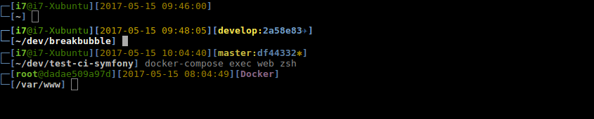

# Sego Oh My ZSH Theme

## Installation
Copy the `sego.zsh-theme` file into your local `oh-my-zsh/themes` folder. Usually its located in your home directory `~/.oh-my-zsh/`.
Adjust your `.zshrc` file to use the docker enabled theme.

